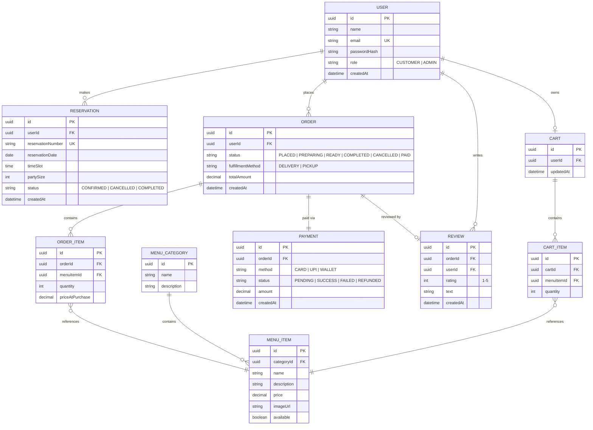

# Data Model / Schema — DineFlow

This diagram reflects the entities and relationships defined in the Business Requirements Document 

## Key Relationships 

| Relationship | Cardinality | Notes |
|---|---|---|
| User → Reservation / Order / Review | 1—N | A user can have many of each |
| MenuCategory → MenuItem | 1—N | Each item belongs to exactly one category |
| Cart → CartItem → MenuItem | 1—N / N—1 | Cart items reference a menu item |
| Order → OrderItem → MenuItem | 1—N / N—1 | Price is snapshotted at purchase time (`priceAtPurchase`), independent of later menu price changes |
| Order → Payment | 1—1 | One payment record per order |
| Order → Review | 1—0..1 | At most one review per order (US-13) |

## Business-Rule Notes Encoded in the Schema
- **US-7 (no double-booking):** `Reservation` capacity is enforced at the `(reservationDate, timeSlot)` level, not per physical table — a `slot_capacity` config (or table) should track max reservations per slot, checked atomically on insert.
- **US-10 (order integrity):** `Order` + `OrderItem` are created in a single transaction; `totalAmount`/`priceAtPurchase` are persisted at creation time and never recalculated.
- **US-13 (one review per order):** enforce a unique constraint on `Review.orderId`.
- **US-16 (payment lifecycle):** `Payment.status` follows `PENDING → SUCCESS | FAILED`, with `REFUNDED` as an admin-only follow-up transition.
